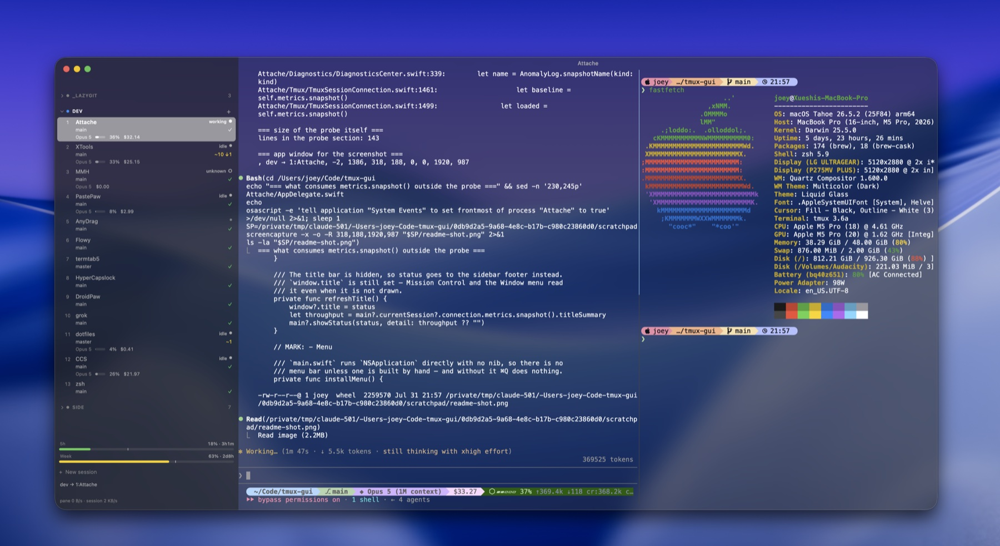

# Attaché

A native macOS window onto a real tmux server. Attach to the same session from
any ordinary terminal and you get the ordinary tmux — the processes never notice
this app exists.

Named for the verb you already type. An attaché is someone assigned to follow
along and carry things for you, which is all this window does: tmux owns every
session, window and pane, and this is the thing attached to it.



## What it is

```
tmux session  →  a group heading in the left rail
tmux window   →  a row under that heading
tmux pane     →  a split in the content area
```

Both levels live in one list. Any session can be opened, not only the one on
screen, and a window can be dragged out of one session and into another.

**The interface holds no state of its own.** Clicking, reordering, renaming and
splitting all turn into tmux commands, and only take visible effect once tmux
reports back — so `prefix + c` typed in another terminal adds a row here by
exactly the same path a click on **+** does.

## How it works

Two connections to the same tmux server, doing different jobs.

**tmux draws the panes.** The content half is one terminal running a plain
`tmux attach` on a pty that [libghostty](https://ghostty.org) owns. The
splitters, every pane and the cursor are tmux's own drawing; the app supplies a
rectangle and nothing else. That is why copy mode, `display-popup` and anything
else tmux puts on screen simply work.

**A control-mode connection drives the rail.** `tmux -C` makes tmux stop drawing
and speak a plain-text protocol instead. That connection is where the session and
window lists come from, what every click turns into, and how the rail learns
about activity, working directories and agent state — all as tmux subscriptions,
so the rail is right from the moment it attaches rather than after the first
change. It attaches with `no-output`, so tmux never sends it pane bytes nobody
would draw.

## What you can do

- **Drag a row** up or down to reorder a window, or onto another session to move
  it there. **Double-click** to rename.
- **Hiding a window kills nothing.** A window may have an agent mid-run and there
  is no undo for that, so hiding only takes the row out of the rail and sends
  tmux nothing at all. Killing is a separate menu item, worded as what it is, and
  it asks first. Hidden windows come back from the `N hidden` row.
- **⌘-click a path or a URL** in a pane to open it.
- **Shortcuts** that sit alongside your own tmux `prefix` bindings rather than
  replacing them: ⌘T new window, ⌘W hide window, ⌘1-9 select window,
  ⌘⇧[ ] previous/next window; ⌃⌘1-9 select session, ⌃⌘[ ] previous/next
  session, ⌘⇧N new session.
- **Activity dots** reuse tmux's own activity flag, so they mean the same thing
  as the `#` in a tmux status line. Git branch and agent state can sit under each
  row too, or be switched off.
- **The right rail has tools**, switched by the icons in its header: the
  conversation of the agent in the window on screen, and a Git tab running
  [lazygit](https://github.com/jesseduffield/lazygit) on the worktree that
  window is sitting in. It follows as you switch windows, restarting only when
  the repository actually changes; swap lazygit for anything else with
  `git_tool_command` in the settings file.
- **Settings live in `~/.config/attache.toml`** — a file you can read, edit,
  diff, keep in a dotfiles repository and restore by hand. The app rewrites only
  the lines it recognises, so your comments and anything it does not know about
  survive.

## Building

See [BUILDING.md](BUILDING.md).

## Working on it

[CLAUDE.md](CLAUDE.md) has the architecture, the invariants worth protecting, how
to verify a change, and the traps already paid for — most of them are things that
look obviously correct and are not. The
[GitHub issues](https://github.com/XueshiQiao/Attache/issues) are the open work.

## Known limits

- Not built yet: search, and more than one app window.
- Not measured yet: anything over ssh.

---

# Attaché（中文）

一个原生 macOS 窗口，开在一台真实的 tmux 服务器上。你可以从任何普通终端 attach 到同一个
会话，得到的就是原本的 tmux —— 里面跑的进程完全不知道这个 app 存在。

名字取自你每天都要敲的那个动词。attaché 是"被派来跟着你、替你拿东西的随员"，而这个窗口做的
就是这件事：会话、窗口、面板全部归 tmux 所有，它只是贴着 tmux 的那个东西。

## 它是什么

```
tmux 会话  →  左栏里的一个分组标题
tmux 窗口  →  该标题下的一行
tmux 面板  →  内容区里的一块分屏
```

两个层级在同一个列表里。任何会话都可以打开，不只是当前那个；一个窗口可以从一个会话拖到
另一个会话里。

**界面自己不持有任何状态。** 点击、拖动排序、重命名、分屏，全部会变成 tmux 命令，并且只有在
tmux 回报之后才会真正生效 —— 所以你在另一个终端里敲 `prefix + c`，这里多出一行的路径，和你
点 **+** 是完全同一条。

## 怎么做到的

两条连到同一台 tmux 服务器的连接，各干各的活。

**面板是 tmux 自己画的。** 内容那一半就是一个终端，跑着普通的 `tmux attach`，pty 归
[libghostty](https://ghostty.org) 所有。分隔线、每个面板、光标，全是 tmux 自己画的；app 只
提供一个矩形，别的什么都不做。所以复制模式、`display-popup`，以及 tmux 会往屏幕上放的任何
东西，都是直接就能用的。

**左栏由一条控制模式连接驱动。** `tmux -C` 让 tmux 停止绘制，改用纯文本协议对话。会话列表和
窗口列表来自这条连接，每一次点击也变成这条连接上的命令；左栏里的活动状态、工作目录、agent
状态也都从这里来 —— 全部用 tmux 的订阅机制，所以左栏从 attach 的那一刻起就是对的，而不是等
第一次变化之后才对。这条连接带 `no-output` 参数，所以 tmux 不会把没人会画的面板字节推给它。

## 你能做什么

- **拖一行**上下移动来给窗口重新排序，或者拖到另一个会话上把它移过去。**双击**改名。
- **隐藏窗口不会杀掉任何东西。** 一个窗口里可能有 agent 正跑到一半，那是没有撤销的，所以隐藏
  只是把这一行从左栏拿走，**完全不给 tmux 发任何命令**。杀掉是另一个菜单项，措辞如实，并且会
  先问你。隐藏的窗口从 `N hidden` 那一行拿回来。
- **⌘-点击**面板里的路径或者网址就能打开。
- **快捷键**和你自己的 tmux `prefix` 绑定并存，不是替换：⌘T 新窗口、⌘W 隐藏窗口、
  ⌘1-9 选窗口、⌘⇧[ ] 上/下一个窗口；⌃⌘1-9 选会话、⌃⌘[ ] 上/下一个会话、⌘⇧N 新会话。
- **活动指示点**直接用 tmux 自己的 activity flag，所以它的含义和 tmux 状态栏里的 `#` 完全
  一致。每行下面还可以显示 git 分支和 agent 状态，也可以关掉。
- **右栏是一组工具**，用它标题行右侧的图标切换：当前窗口里 agent 的对话，以及一个 Git
  标签页 —— 在这个窗口所在的 worktree 上跑
  [lazygit](https://github.com/jesseduffield/lazygit)。它跟着你切窗口走，只有仓库真的变了
  才会重启；想换掉 lazygit，改设置文件里的 `git_tool_command` 就行。
- **设置存在 `~/.config/attache.toml`** —— 一个你能读、能改、能 diff、能放进 dotfiles 仓库、
  能手工恢复的文件。app 只会重写它认识的那些行，所以你写的注释和它不认识的键都会原样保留。

## 构建

见 [BUILDING.md](BUILDING.md)。

## 参与开发

[CLAUDE.md](CLAUDE.md) 写了架构、值得守住的不变量、怎么验证一个改动，以及已经付过学费的那些
坑 —— 它们大多数看起来"显然是对的"，其实不是。[GitHub issues](https://github.com/XueshiQiao/Attache/issues) 是待办。

## 已知限制

- 还没做：搜索，以及多开 app 窗口。
- 还没测：任何走 ssh 的情况。
